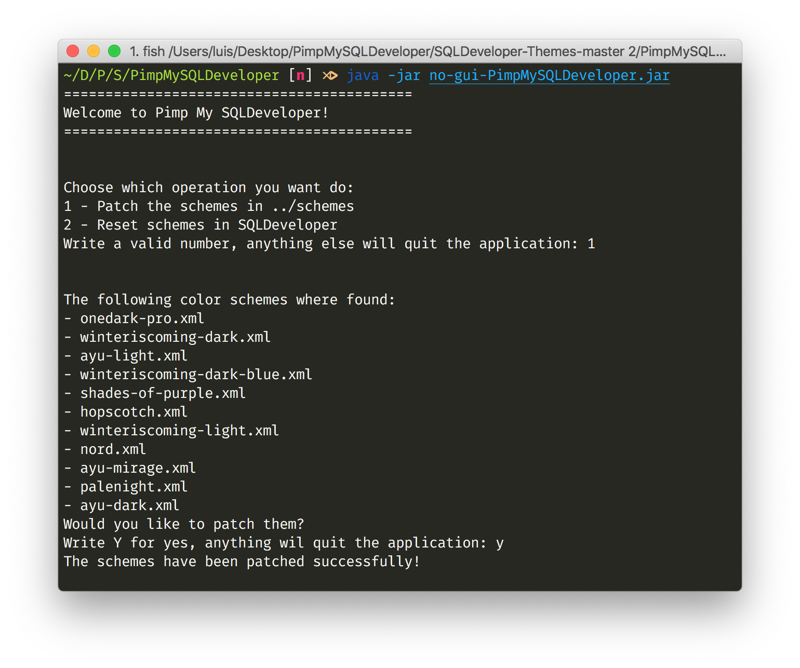

# Pimp My SQLDeveloper

> So you wanna be a player, but your SQLDeveloper ain't fly....

We have all been there, opening up SQLDeveloper for the first time just to be greated by a blasting Blueish Light Mode. You try to change the color scheme to one of the default ones, but all of them are terrible. Confused and frustrated you try to find alternatives online, but only stumble into a handful of themes with a more than 2-click long install process. Defeated and with tears in your eyes you mumble: "I guess I'll just use the default config...". **Worry no more! Pimp My SQLDeveloper is here to solve this extremely specific problem!**

# Requirements

There are two versions of Pimp My SQLDeveloper:

- JavaFX version **(requires JDK 8)**

- Console only version (runs on any JDK >= 8)

Both of them do exactly the same: install and reset color schemes, the only difference being that the JavaFX version allows you to check specifically what schemes you want while the console installs all of them.

The other important consideration is that both .jar must have access to the folder: **../schemes**, in order to get the schemes it's going to install.

# Patching the schemes

1. If you are using the JavaFX simply double-click the .jar. If you are using the console version, run this command in the .jar directory: `java -jar no-gui-PimpMySQLDeveloper`

2. Select which schemes you want to install (the console version will install all of them).

3. Click Patch!

4. Done 🎉

# Resetting the schemes

If for some reason you want to re-install your themes or return to only the default ones, choose **Reset**. This will delete all the content in the SQLDeveloper themes file, including the default themes. After that **you'll need to open and close SQLDeveloper**, since the themes file will only be restored to it's default value once the program closes.

# Contributing

This project was built using Intellij IDEA on Java 8.

So far the application is done, but if you think that you have anything of value to add, like support for JavaFx in later versions of Java feel free to create a pull request.
