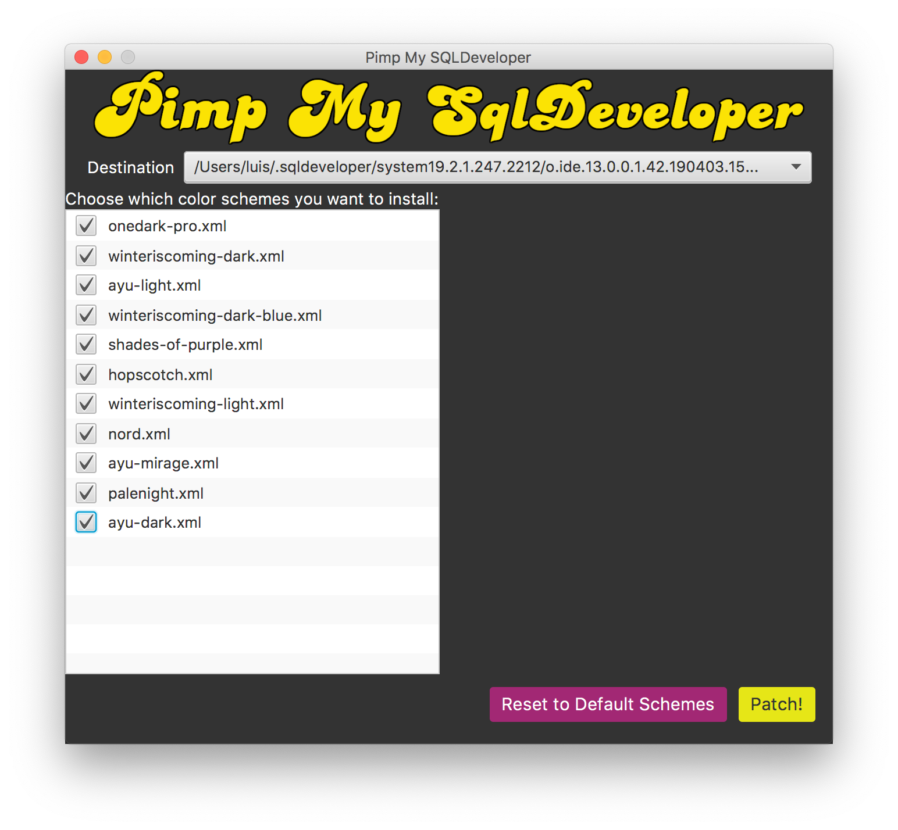
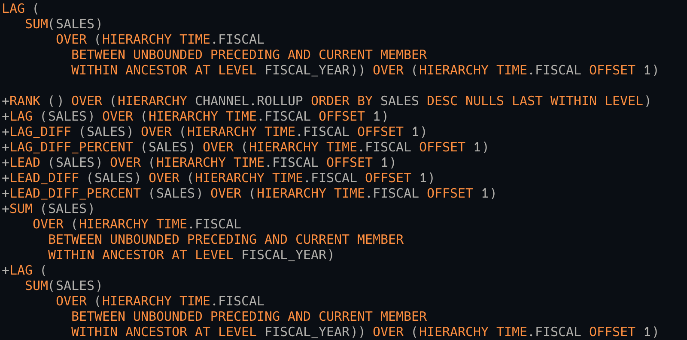
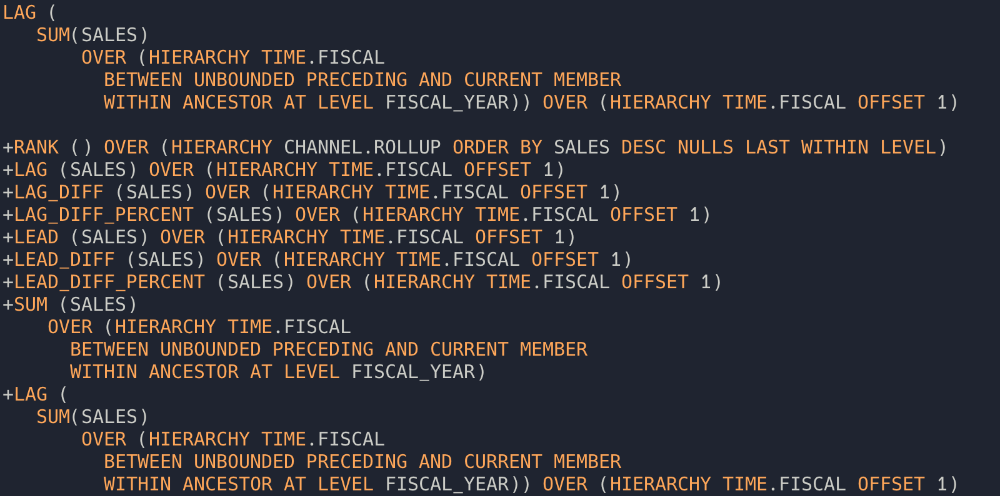
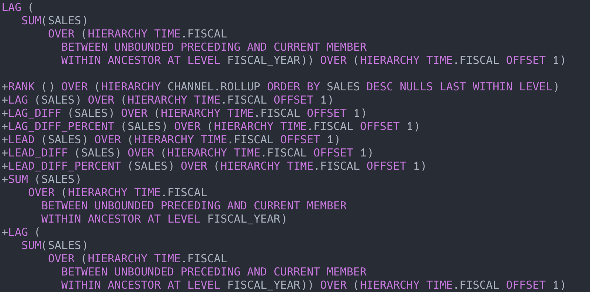
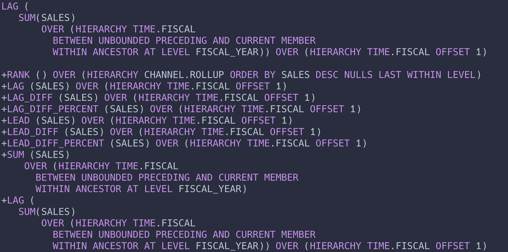
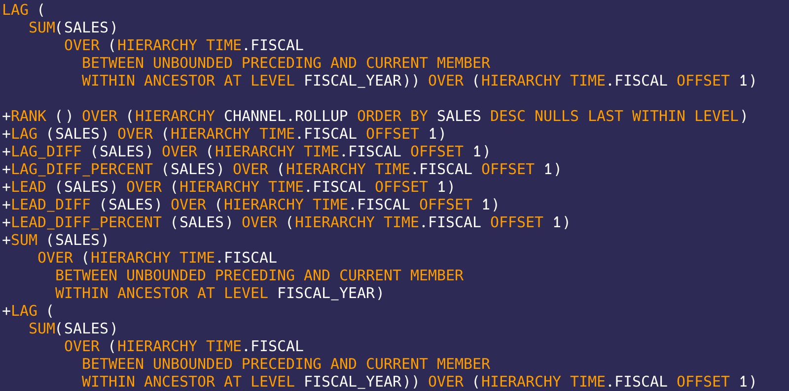
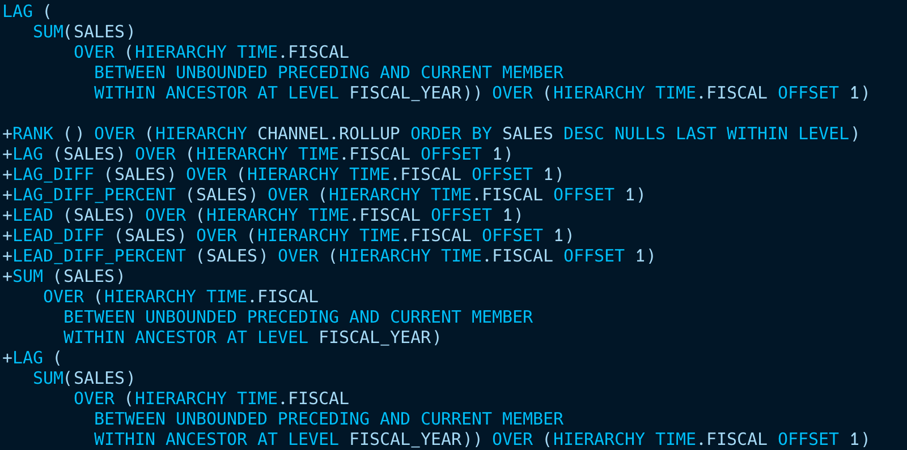
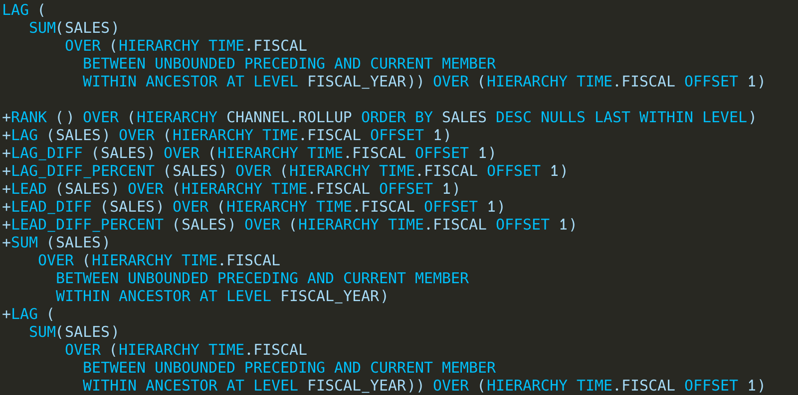
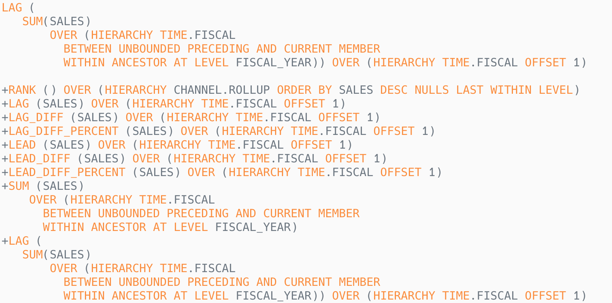
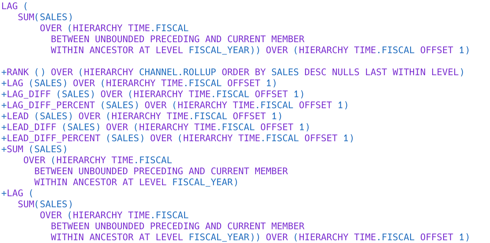

# SQLDeveloper Themes

## Intro

In this repository you will find:

- [Pimp My SQLDeveloper](#pimp-my-sqldeveloper) - a tool that removes the hassle of installing schemes in SQLDeveloper

- [Color Schemes](#color-schemes)

- UI themes (WIP)

Feel free to ask for new themes, report bugs or even contribute 😀!

## Pimp My SQLDeveloper

Since patching themes for SQLDeveloper is a pretty annoying task (all themes need to be stored in a huge xml file in a folder deep in the settings) I've created Pimp My SQLDeveloper to make the job easier. [Click Here to check it out!](./PimpMySQLDeveloper.html)

## Color Schemes

Currently the only color schemes available are conversions of some of the most
popular themes for Visual Studio Code. If you want to contribute with a new color scheme please add it's xml file, an example image of it's syntax and a link to the original repository, like in the schemes below:

### Ayu-Dark

[Original Repo](https://github.com/ayu-theme/vscode-ayu)

### Ayu-Mirage

[Original Repo](https://github.com/ayu-theme/vscode-ayu)

### Hopscotch

[Original Repo](https://github.com/idleberg/vscode-hopscotch)

### Nord Color Theme

[Original Repo](https://github.com/arcticicestudio/nord-visual-studio-code)

### OneDark Pro

[Original Repo](https://github.com/Binaryify/OneDark-Pro)

### Palenight

[Original Repo](https://github.com/whizkydee/vscode-material-palenight-theme)

### Shades of Purple

[Original Repo](https://github.com/ahmadawais/shades-of-purple-vscode)

### Winter is Coming Dark Blue

[Original Repo](https://github.com/johnpapa/vscode-winteriscoming)

### Winter is Coming Dark

[Original Repo](https://github.com/johnpapa/vscode-winteriscoming)

### Ayu-Light

[Original Repo](https://github.com/ayu-theme/vscode-ayu)

### Winter is Coming Light

[Original Repo](https://github.com/johnpapa/vscode-winteriscoming)

