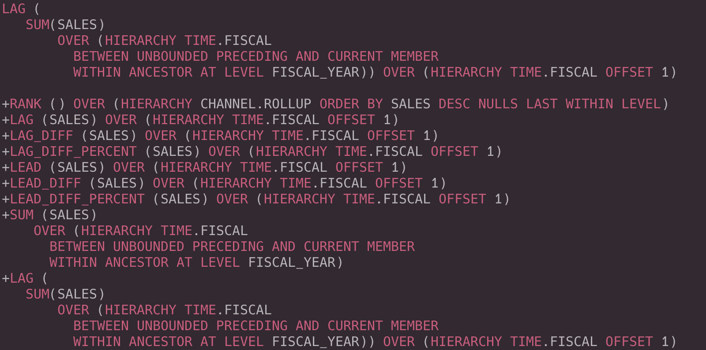

# SQLDeveloper Themes

## Intro
SQLDeveloper Themes is a collection of color schemes and UI themes for Oracle's 
SQLDeveloper. A JavaFX installer is also provided, since it is pretty cumbersome
to install this themes manually.

## Color Schemes

Currently the only color schemes available are conversions of some of the most
popular themes for Visual Studio Code. Feel free to add your own or other 
conversions 😀

### Ayu-Dark
[Original Repo](https://github.com/ayu-theme/vscode-ayu)

### Ayu-Mirage
[Original Repo](https://github.com/ayu-theme/vscode-ayu)

### Hopscotch
[Original Repo](https://github.com/idleberg/vscode-hopscotch)

### Nord Color Theme
[Original Repo](https://github.com/arcticicestudio/nord-visual-studio-code)

### OneDark Pro
[Original Repo](https://github.com/Binaryify/OneDark-Pro)

### Palenight
[Original Repo](https://github.com/whizkydee/vscode-material-palenight-theme)

### Shades of Purple
[Original Repo](https://github.com/ahmadawais/shades-of-purple-vscode)

### Winter is Coming Dark Blue
[Original Repo](https://github.com/johnpapa/vscode-winteriscoming)

### Winter is Coming Dark
[Original Repo](https://github.com/johnpapa/vscode-winteriscoming)

### Ayu-Light
[Original Repo](https://github.com/ayu-theme/vscode-ayu)

### Winter is Coming Light
[Original Repo](https://github.com/johnpapa/vscode-winteriscoming)

